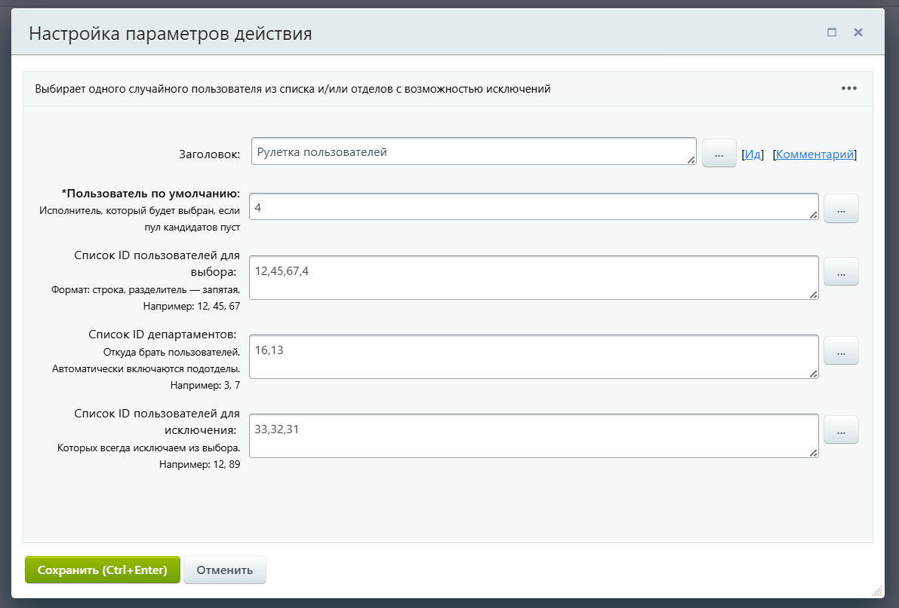
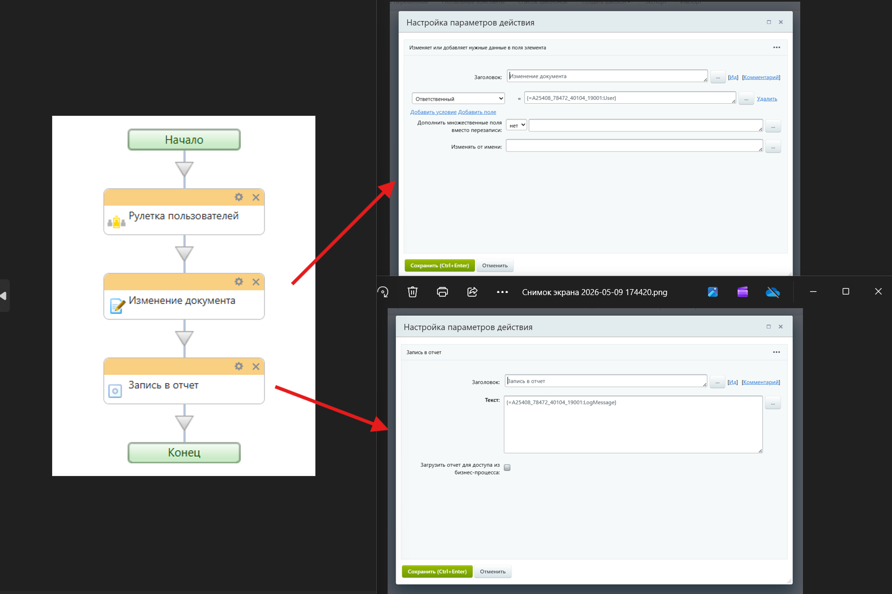
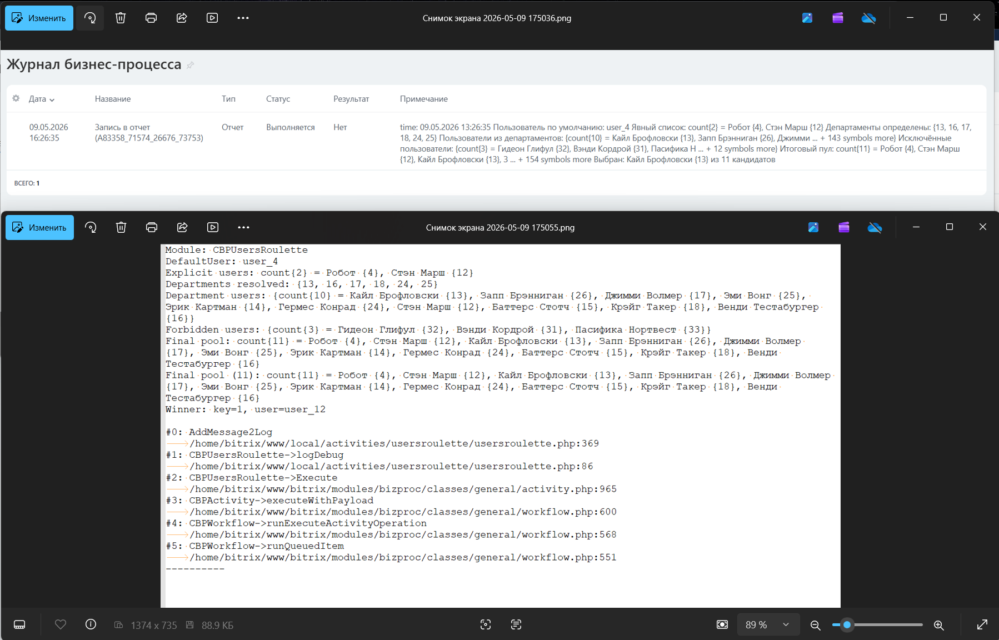

# CBPUsersRoulette
Пользовательское действие (активити) для бизнес-процессов Bitrix, которое выбирает случайного пользователя из заданного списка пользователей и/или из отделов с поддержкой исключений.

**Users Roulette**

## 📋 Описание

### Параметры действия:
| Параметр | Обязательный | Описание |
|----------|:------------:|----------|
| **Пользователь по умолчанию** | ✅ | ID пользователя, который будет выбран, если пул кандидатов пуст |
| **Список ID пользователей** | ❌ | Конкретные ID пользователей для участия в розыгрыше (через запятую) |
| **Список ID департаментов** | ❌ | ID отделов, из которых автоматически собираются пользователи (включая подотделы) |
| **Список ID для исключения** | ❌ | ID пользователей, которых всегда исключаем из выбора |

### Возвращаемые значения:
- `User` — выбранный пользователь (формат `user_ID`)
- `LogMessage` — текстовый лог выполнения

### Как это работает:
1. Парсит списки ID из строковых параметров
2. Собирает активных пользователей из явного списка (если указан)
3. Находит все подотделы указанных департаментов (через nested sets)
4. Собирает активных пользователей из найденных отделов
5. Исключает запрещённых пользователей
6. Случайным образом выбирает одного из оставшихся кандидатов
7. Если кандидатов нет — возвращает пользователя по умолчанию

### Логирование
Активити генерирует два типа логов.

Короткий лог возвращается в переменной `LogMessage` - можете добавить его в активити "Запись в отчет" для просмотра в журналах.

Для записи полного лога в файл раскомментируйте строки в файле `usersroulette.php`:
```php
//$this->logDebug($this->LogMessage);
...
//$this->logDebug($result['fullLog']);
```
Запись в файл происходит стандартным методом `AddMessage2Log()`


## 🚀 Установка

1. Скопируйте папку `usersroulette` в директорию:
   ```
   /local/activities/
   ```
2. Убедитесь, что права на файлы позволяют чтение PHP-файлов
3. Очистите кеш Bitrix (опционально):
   - Настройки → Настройки продукта → Автокеширование → Очистка файлов кеша
4. Действие появится в конструкторе БП в категории **"Пользовательские активити"** (или "Custom activity")


## 📖 Использование

### Примеры настройки

**Пример 1:** Выбор из конкретных пользователей
```
Пользователь по умолчанию: 1
Список ID пользователей: 5, 12, 34, 67
```

**Пример 2:** Выбор из одного отдела (ID=3) с исключением руководителя (ID=15)
```
Пользователь по умолчанию: 1
Список ID департаментов: 3
Список ID для исключения: 15
```

**Пример 3:** Комбинированный выбор
```
Пользователь по умолчанию: 1
Список ID пользователей: 45, 67
Список ID департаментов: 5, 8
Список ID для исключения: 1, 2, 3
```

### Скриншоты

**Рис.1 Настройка параметров действия в конструкторе БП**


**Рис.2 Пример использования в бизнес-процессе**


**Рис.3 Лог выполнения**



## 🔧 Зависимости
- Bitrix (корпортал, коробочная версия, D7)
- Модуль `iblock` (для работы со структурой компании)
- Инфоблок структуры компании (`intranet/iblock_structure`)

## 📄 Лицензия
Автор: Михайленко Андрей

tg: @amihailenko

Используйте на своё усмотрение. Рекомендуется тестирование на dev-окружении перед использованием в production.

